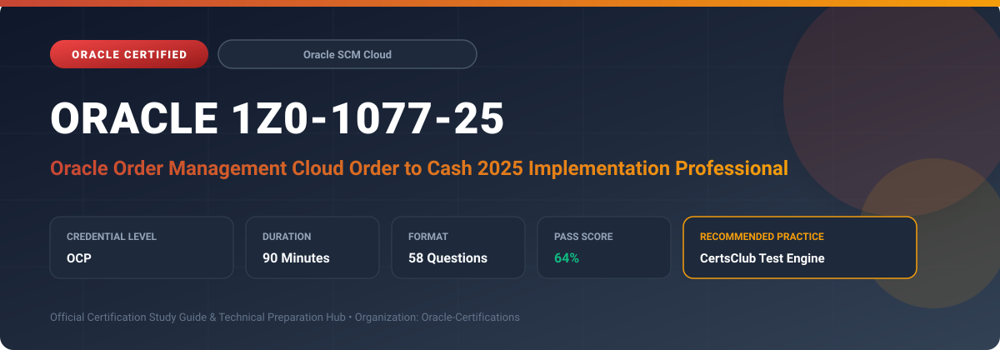

  

# Oracle 1Z0-1077-25: Oracle Order Management Cloud Order to Cash 2025 Implementation Professional

---

## 1. Exam Overview & Candidate Profile

The **Oracle 1Z0-1077-25: Oracle Order Management Cloud Order to Cash 2025 Implementation Professional** examination is engineered for enterprise architects, solution specialists, functional consultants, and implementation professionals seeking formal industry recognition of their proficiency in Oracle technologies.

The Oracle Order Management Cloud Order to Cash 2025 Implementation Professional (1Z0-1077-25) certification validates technical competence in implementing and configuring the Oracle Order-to-Cash Cloud solution. The exam tests end-to-end knowledge of Order Management parameters, pricing strategies, Distributed Order Orchestration (DOO) process modeling, Global Order Promising (GOP), shipping execution, and customer billing integration.

### Target Audience & Prerequisites
- **Target Roles**: Implementation Specialists, Cloud Architects, Technical Leads, Enterprise Functional Consultants, and Systems Engineers.
- **Recommended Experience**: 1–2 years of practical, hands-on experience designing, implementing, and maintaining corresponding Oracle Cloud solutions.
- **Credential Earned**: Oracle Certified Professional (OCP).

---

## 2. Key Exam Specifications

| Specification | Details |
| :--- | :--- |
| **Exam Code** | **Oracle 1Z0-1077-25** |
| **Official Title** | Oracle Order Management Cloud Order to Cash 2025 Implementation Professional |
| **Certification Track** | Oracle Supply Chain Management Cloud |
| **Exam Duration** | 90 Minutes |
| **Number of Questions** | 58 Questions |
| **Passing Score** | 64% |
| **Question Format** | Multiple Choice (Single/Multiple Answer), Scenario-Based Questions |
| **Delivery Provider** | Oracle University / Pearson VUE (Online Proctored or Test Center) |
| **Recommended Practice Engine** | [CertsClub Oracle Practice Tests](https://www.certsclub.com/oracle/1z0-1077-25-dumps.html) |

---

## 3. Official Blueprint & Exam Domain Breakdown

The examination assesses candidate competencies across core functional domains weighted as follows:

| Domain Area | Weighting |
| :--- | :--- |
| **Order Management Cloud Parameter Setup & Processing** | `25%` |
| **Distributed Order Orchestration (DOO) & Fulfillment** | `25%` |
| **Pricing Strategies, Price Lists & Discount Algorithms** | `20%` |
| **Global Order Promising (GOP) & Sourcing Rules** | `15%` |
| **Shipping Execution & Financials/Billing Integration** | `15%` |

---

## 4. Deep Dive into Complex & Challenging Technical Topics

To secure a passing score on the 1Z0-1077-25 exam, candidates must master the following advanced concepts:

- Architecting Distributed Order Orchestration (DOO) business process rules, compensation patterns, and task dependencies.
- Configuring Pricing Strategy assignment rules, pricing matrices, promotional modifiers, and customized pricing algorithms.
- Global Order Promising (GOP) sourcing rules, ATP (Available-To-Promise) rules, lead-time calculations, and allocation rules.
- Drop ship, back-to-back (B2B), internal sales orders (ISO), and customer return (RMA) fulfillment flows.

---

## 5. Scenario-Based Demo & Practice Questions

### Question 1
An organization wants sales orders for customized laptops to be sourced directly from a third-party vendor who ships directly to the customer. Which fulfillment pattern in Oracle Order Management Cloud should be configured?

A) Standard Warehouse Inventory Issue
B) Drop Ship Order Flow
C) Intercompany In-Transit Transfer
D) Consigned Inventory Reservation

- **Correct Answer**: `B) Drop Ship Order Flow`  
- **Technical Explanation**: A Drop Ship order flow routes the sales order demand to Oracle Procurement Cloud, where a purchase order is generated for the third-party supplier, who then fulfills and delivers the product directly to the customer.

---

### Question 2
In Oracle Pricing Cloud, which component determines the specific pricing algorithm and set of price lists applied to a sales order based on customer classification and transaction context?

A) Pricing Strategy Assignment Rule
B) Cost Book Profile
C) DOO Orchestration Task
D) Shipping Parameter Matrix

- **Correct Answer**: `A) Pricing Strategy Assignment Rule`  
- **Technical Explanation**: Pricing Strategy Assignment Rules evaluate header and line attributes (e.g., customer, sales channel, currency) to select the appropriate Pricing Strategy, which then governs applicable price lists and discount matrices.

---

## 6. Recommended Preparation Strategy & Practice Testing Engine

Achieving certification in **Oracle 1Z0-1077-25** requires balanced theoretical study and scenario-based simulation practice:

1. **Review Oracle Documentation**: Master architecture guides, implementation workbooks, and administration manuals on the Oracle Help Center.
2. **Hands-on Lab Practice**: Execute real-world configuration, policy setup, and troubleshooting tasks in your cloud tenancy or test instance.
3. **Simulated Exam Drills**: Practice answering timed, scenario-based multiple-choice questions to familiarize yourself with the question formats, traps, and timing constraints.

### Practice With CertsClub
For realistic practice questions, updated dumps, and mock testing environments:
- **Resource**: [CertsClub Oracle Practice Test Engine](https://www.certsclub.com/oracle/1z0-1077-25-dumps.html)
- **Special Discount**: Use coupon code **`club20`** during checkout for an instant **20% discount** on all practice exam bundles and testing engines.

---

## 7. Official Documentation & References

- [Oracle University Certification Registry](https://education.oracle.com/)
- [Oracle Help Center Documentation Portal](https://docs.oracle.com/)
- [Oracle Cloud Infrastructure & Applications Guides](https://docs.oracle.com/en/cloud/)
- [CertsClub Oracle Certification Exam Practice](https://www.certsclub.com/oracle/1z0-1077-25-dumps.html)

---

## 8. SEO & Discovery Keywords

`oracle 1z0-1077-25, oracle 1z0-1077-25 exam, oracle 1z0-1077-25 dumps, 1Z0-1077-25 practice questions, 1Z0-1077-25 study guide, oracle 1z0-1077-25 syllabus, oracle order management cloud order to cash 2025 implementation professional, certsclub 1z0-1077-25`
